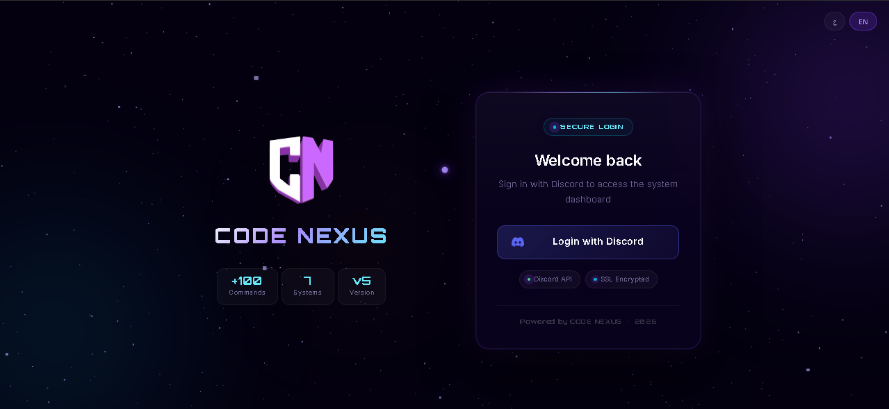

<div align="center">



# 🤖 Bot Discord Dashboard ALL-IN-ONE
### Next Generation — v5.0.0

**A full-featured Discord bot with an integrated web dashboard built for modern Discord servers.**  
Protection · Moderation · Tickets · Auto Roles · Levels · Dashboard · and more.

[](https://discord.gg/UvEYbFd2rj)
[](LICENSE)
[](https://nodejs.org)
[](https://discord.js.org)

[](https://ko-fi.com/code_nexus)
[](https://www.paypal.com/paypalme/rewebby)

</div>

---

## 📋 Table of Contents

- [Features](#-features)
- [Requirements](#-requirements)
- [Quick Start — Local (VS Code)](#-quick-start--local-vs-code)
- [Hosting on Pterodactyl](#-hosting-on-pterodactyl)
- [Docker](#-docker)
- [Configuration](#-configuration)
- [Dashboard Setup](#-dashboard-setup)
- [Project Structure](#-project-structure)
- [Support & Donations](#-support--donations)
- [License](#-license)

---

> [!IMPORTANT]
> ## ⚠️ Required Setup Before Starting
>
> After cloning the project, open `settings.json` and find the `DASHBOARD` section.
> You **must** fill in the following fields or the dashboard/bot will not work correctly:
>
> ```json
> "DASHBOARD": {
>     "OWNERS": ["YOUR_DISCORD_USER_ID"],
>     "SHIPS": ["YOUR_DISCORD_USER_ID"],
>     "CODE": "YOUR_SECRET_ACCESS_CODE",
>     ...
> }
> ```
>
> | Field | Description |
> |-------|-------------|
> | `OWNERS` | Your Discord user ID(s). Owners have full access to the dashboard. Add multiple IDs as an array. |
> | `SHIPS` | Discord user ID(s) with elevated/super-admin privileges on the dashboard. |
> | `CODE` | The access code required to log into the dashboard (default is `"ADMIN"` — **change it!**). |
>
> **How to get your Discord User ID:**
> Enable Developer Mode in Discord → right-click your profile → **Copy User ID**.

---

## ✨ Features

| Category | Highlights |
|----------|-----------|
| 🛡️ **Protection** | Anti-Ban, Anti-Kick, Anti-Bots, Anti-Webhooks, Anti-Channel Create/Delete, Anti-Role Add/Delete |
| ⚖️ **Moderation** | Ban, Kick, Mute, Warn, Jail, Clear, Lock/Unlock, Slowmode, Rename |
| 👥 **Roles** | Auto-Role (members / bots / invite), Temp Role, Multi-Role, Permission Control |
| 🎟️ **Tickets** | Multi-panel, HTML transcripts, Feedback, Stats, Log channel |
| 📊 **Utility** | Server/User info, Avatar, Banners, Ping, AFK, Help |
| 🌐 **Dashboard** | Discord OAuth2, Live editing of all settings, Beautiful UI |
| 📝 **Logging** | Full audit log for every moderation action |
| 🌍 **Multi-language** | English & Arabic — configurable per guild |

---

## 📦 Requirements

- **Node.js** v20 or higher → [Download](https://nodejs.org)
- **npm** v9+ (comes with Node.js)
- A **Discord Application** with a bot user → [Discord Developer Portal](https://discord.com/developers/applications)

---

## 🚀 Quick Start — Local (VS Code)

### Step 1 — Clone the repository

```bash
git clone https://github.com/aymenelouadi/Bot-Discord-Dashboard-ALL-IN-ONE---Next-Generation.git
cd "Bot-Discord-Dashboard-ALL-IN-ONE---Next-Generation"
```

### Step 2 — Install dependencies

```bash
npm install
```

### Step 3 — Configure environment

```bash
# Windows
copy .env.example .env

# Mac / Linux
cp .env.example .env
```

Open `.env` in VS Code and fill in your values:

```env
DISCORD_TOKEN=your_bot_token_here
CLIENT_ID=your_application_client_id
CLIENT_SECRET=your_oauth2_client_secret
QAUTH_LINK=http://localhost:2000/auth/discord/redirect
DASHBOARD_PORT=2000
SESSION=any_random_long_string_here
```

> **Where to find these values:**
> 1. Go to [Discord Developer Portal](https://discord.com/developers/applications)
> 2. Select your application → **Bot** tab → copy the **Token**
> 3. **General Information** tab → copy **Application ID** (`CLIENT_ID`)
> 4. **OAuth2** tab → copy **Client Secret** and add the redirect URL

### Step 4 — Configure the bot

Edit `settings.json` to set your prefix, language, and other options:

```json
{
  "system": {
    "PREFIX": "!",
    "COMMANDS": {
      "ENABLE_PREFIX": true,
      "ENABLE_SLASH_COMMANDS": true,
      "STATUS": "ONLINE",
      "lang": "en"
    }
  }
}
```

### Step 5 — Start

```bash
# Start the bot (also starts the dashboard automatically)
npm start
```

Open your browser at **http://localhost:2000** to access the dashboard.

> **VS Code tip:** Press `Ctrl+Shift+P` → **Tasks: Run Task** → create a `npm: start` task, or simply open a terminal and run `npm start`.

---

## 🐦 Hosting on Pterodactyl

Pterodactyl is a game/application panel often used by Discord bot hosts.

### Step 1 — Upload files

1. Zip the entire project folder (excluding `node_modules/` and `.env`).
2. Upload the zip to your Pterodactyl server's **File Manager**.
3. Unzip it in the root of your server directory.

### Step 2 — Set Startup Command

In your Pterodactyl egg settings, set the startup command to:

```
node index.js
```

Or if you are using a **Node.js** egg:

| Field | Value |
|-------|-------|
| Startup | `node {{MAIN_FILE}}` |
| Main File | `index.js` |
| Node.js version | `20` |

### Step 3 — Set Environment Variables

In the Pterodactyl panel → **Startup** tab, add these variables:

| Key | Value |
|-----|-------|
| `DISCORD_TOKEN` | Your bot token |
| `CLIENT_ID` | Your application client ID |
| `CLIENT_SECRET` | Your OAuth2 client secret |
| `QAUTH_LINK` | `https://yourdomain.com/auth/discord/redirect` |
| `DASHBOARD_PORT` | `2000` (or whatever port your egg exposes) |
| `SESSION` | A long random string |

### Step 4 — Allocations / Port

Make sure port **2000** (or your chosen `DASHBOARD_PORT`) is allocated and exposed by your host.

### Step 5 — Start the server

Click **Start** in the Pterodactyl panel. The bot and dashboard will launch together.

---

## 🐳 Docker

```bash
# Build the image
docker build -t bot-dashboard .

# Run (replace values with your real credentials)
docker run -d \
  -p 2000:2000 \
  -e DISCORD_TOKEN=your_token \
  -e CLIENT_ID=your_client_id \
  -e CLIENT_SECRET=your_client_secret \
  -e QAUTH_LINK=http://localhost:2000/auth/discord/redirect \
  -e DASHBOARD_PORT=2000 \
  -e SESSION=your_session_secret \
  --name my-bot \
  bot-dashboard
```

Or use **Docker Compose** — create a `docker-compose.yml`:

```yaml
version: "3.9"
services:
  bot:
    build: .
    ports:
      - "2000:2000"
    environment:
      DISCORD_TOKEN: your_token
      CLIENT_ID: your_client_id
      CLIENT_SECRET: your_client_secret
      QAUTH_LINK: http://localhost:2000/auth/discord/redirect
      DASHBOARD_PORT: 2000
      SESSION: your_session_secret
    restart: unless-stopped
```

```bash
docker compose up -d
```

---

## ⚙️ Configuration

### `.env` — Secrets

| Variable | Description |
|----------|-------------|
| `DISCORD_TOKEN` | Your bot's token (keep this **private**) |
| `CLIENT_ID` | Discord Application ID |
| `CLIENT_SECRET` | OAuth2 secret for the dashboard login |
| `QAUTH_LINK` | OAuth2 redirect URL (must match Discord dev portal) |
| `DASHBOARD_PORT` | Port for the web dashboard (default: `2000`) |
| `SESSION` | Random secret string for session encryption |

### `settings.json` — Guild Configuration

| Key | Description |
|-----|-------------|
| `system.PREFIX` | Bot command prefix (default: `!`) |
| `system.COMMANDS.lang` | Language: `en` or `ar` |
| `system.COMMANDS.STATUS` | Bot status: `ONLINE`, `IDLE`, `DND`, `INVISIBLE` |
| `actions.*` | Per-command role permissions and toggles |
| `court.*` | Court/complaint system settings |

---

## 🌐 Dashboard Setup

1. Go to [Discord Developer Portal](https://discord.com/developers/applications) → your app → **OAuth2 → Redirects**
2. Add your redirect: `http://localhost:2000/auth/discord/redirect` (or your domain in production)
3. Make sure `CLIENT_SECRET` and `QAUTH_LINK` in `.env` match exactly.
4. Start the bot and navigate to **http://localhost:2000**
5. Click **Login with Discord** — you'll be redirected to Discord to authorise, then back to the dashboard.

---

## 📁 Project Structure

```
├── commands/           Slash + text commands (one file per command)
├── systems/            Business-logic modules (auto_role, protection, tickets…)
├── dashboard/
│   ├── server.js       Express web server entry point
│   ├── routes/         Auth route handlers
│   ├── middleware/      Session & auth guards
│   ├── views/          EJS templates (one per dashboard page)
│   ├── public/         Static assets (JS, CSS)
│   └── utils/          Dashboard helpers (discord API, guildDb…)
├── database/           Flat-file JSON state (gitignored at runtime)
├── utils/              Shared bot utilities (settings, guards, lang…)
├── index.js            Bot entry point
├── settings.json       Guild configuration
├── .env.example        Environment template (copy to .env)
└── Dockerfile          Container definition
```

---

## 💬 Support

Got a question or a bug? Join our Discord and open a ticket:

[](https://discord.gg/UvEYbFd2rj)

---

## 💖 Donations

If this project helped you, consider supporting the team:

| Platform | Link |
|----------|------|
| ☕ Ko-fi | [ko-fi.com/code_nexus](https://ko-fi.com/code_nexus) |
| 💳 PayPal | [paypal.me/rewebby](https://www.paypal.com/paypalme/rewebby) |

Your support helps us keep building and maintaining free, open-source Discord tools. ❤️

---

## 📄 License

This project is licensed under the **MIT License** — see [LICENSE](LICENSE) for details.

---

<div align="center">

Made with ❤️ by the **Code Nexus Team**  
[Discord](https://discord.gg/UvEYbFd2rj) · [Ko-fi](https://ko-fi.com/code_nexus) · [PayPal](https://www.paypal.com/paypalme/rewebby)

</div>
